# Malaria Parasite Detection using Image Thresholding (Python + Verilog + Vivado)

## Project Overview

This project demonstrates a simplified workflow for malaria parasite detection using image processing and digital hardware design concepts.

The objective is to combine:

- Python image preprocessing
- Threshold-based detection
- HEX data generation
- Verilog hardware logic
- Vivado simulation
- Infected region counting
- FPGA synthesis analysis

This project is educational and demonstrates how software image processing can interact with hardware logic design.

---

# Important Note About Hardware

This project uses **hardware design concepts**, but a **physical FPGA board was not used**.

What was done:

✓ Verilog hardware modules were designed  
✓ Logic was simulated in Vivado  
✓ Waveforms were generated  
✓ Design synthesis was performed  
✓ FPGA resource utilization was analyzed  

What was NOT done:

✗ FPGA board programming  
✗ Camera connection  
✗ Live hardware execution  
✗ Real-time sensor processing  

So the hardware part of this project exists as:

- Hardware Description Language (Verilog)
- Hardware simulation
- Virtual FPGA synthesis

The project validates hardware behavior through simulation.

---

# Problem Statement

Malaria diagnosis often involves manually inspecting blood smear images under a microscope.

Traditional diagnosis:

- requires trained experts
- consumes time
- may introduce human error

This project demonstrates a basic automated pipeline that identifies suspicious regions through image processing and hardware logic.

---

# Complete Architecture Flow

Dataset  
↓  
Read image  
↓  
Convert to grayscale  
↓  
Apply threshold  
↓  
Generate binary mask  
↓  
Detect parasite regions  
↓  
Convert pixels → image.hex  
↓  
Feed HEX data into Verilog  
↓  
Verilog threshold logic  
↓  
Waveform generation  
↓  
Infected counter  
↓  
Vivado synthesis  
↓  
Utilization report  

---

# Project Folder Structure

```text
Malaria_Project

├── dataset/
│   ├── Parasitized/
│   └── Uninfected/
│
├── python/
│   ├── load_images.py
│   ├── otsu_threshold.py
│   ├── parasite_detect.py
│   ├── clean_detect.py
│   ├── threshold_test.py
│   └── generate_hex.py
│
├── hex_output/
│   └── image.hex
│
├── verilog/
│   ├── pixel_threshold.v
│   ├── infected_counter.v
│   └── tb_pixel_threshold.v
│
├── screenshots/
│
└── malaria_detection.xpr
```

---

# Step-by-Step Workflow Explanation

## Step 1: Dataset Collection

Dataset contains:

- Parasitized blood cell images
- Uninfected blood cell images

Purpose:

Provide input images for processing.

Output:

Raw blood cell image dataset.

---

## Step 2: Read Images

Python file:

```python
load_images.py
```

Purpose:

Load blood smear images into memory.

Why?

Image processing cannot begin until image data is loaded.

Operations performed:

- read image
- resize image
- display image

Output:

Loaded image.

---

## Step 3: Convert Image to Grayscale

Purpose:

Reduce image complexity.

Original image:

RGB:

- Red
- Green
- Blue

Converted into:

Single grayscale intensity value

Why?

Threshold operations work more effectively on grayscale images.

Output:

Grayscale image.

---

## Step 4: Apply Threshold

Python file:

```python
otsu_threshold.py
```

Purpose:

Separate dark and bright regions.

Logic:

```text
Pixel > threshold → white

Pixel < threshold → black
```

Why?

Parasite regions generally appear darker.

Output:

Threshold image.

---

## Step 5: Generate Binary Mask

Purpose:

Convert image into:

```text
0 → background

1 → detected region
```

Why?

Binary masks simplify region detection.

Output:

Black and white image.

---

## Step 6: Detect Parasite Regions

Python file:

```python
parasite_detect.py
```

Purpose:

Identify suspicious infected areas.

Operations may include:

- contour detection
- filtering
- segmentation

Output:

Detected parasite regions.

---

## Step 7: Convert Image Pixels to HEX

Python file:

```python
generate_hex.py
```

Purpose:

Convert image pixel values into FPGA-compatible format.

Example:

Decimal:

```text
50
130
200
100
```

HEX:

```text
32
82
c8
64
```

Output:

```text
image.hex
```

Why?

Verilog cannot directly process image files.

HEX acts as a bridge between software and hardware logic.

---

# Verilog Hardware Design Section

## pixel_threshold.v

Purpose:

Compare pixel values against threshold.

Logic:

```verilog
if(pixel > threshold)
    out_pixel = 1;

else
    out_pixel = 0;
```

Function:

Acts as hardware threshold logic.

---

## infected_counter.v

Purpose:

Count infected pixels.

Logic:

Whenever:

```text
out_pixel =1
```

Counter increases.

Example:

Input:

```text
50
130
200
100
```

Threshold:

```text
120
```

Results:

```text
50 → normal

130 → infected

200 → infected

100 → normal
```

Final count:

```text
2
```

---

## tb_pixel_threshold.v

Purpose:

Simulate hardware behavior.

Without physical FPGA hardware, simulation verifies whether logic works correctly.

Input sequence:

```text
50
130
200
100
```

Checks:

- threshold logic
- output generation
- infected count

---

# Waveform Analysis

Vivado simulation generates:

- pixel
- threshold
- out_pixel
- count
- clock

Purpose:

Visual verification of design behavior.

Observed result:

```text
count=2
```

Meaning:

Two pixels crossed threshold.

---

# Synthesis

Vivado converts Verilog logic into FPGA implementation.

Generated outputs:

- hardware netlist
- synthesized design
- FPGA mapping

Purpose:

Verify hardware structure.

---

# Utilization Report

Displays:

- Slice LUTs
- Registers
- I/O usage

Purpose:

Shows FPGA resource usage.

---

# Software Requirements

Install:

- Python 3.10+
- Visual Studio Code
- Vivado 2025.x
- Git (optional)

---

# Python Libraries

Install using:

```bash
pip install opencv-python
pip install numpy
pip install matplotlib
pip install pillow
```

---

# Hardware Requirements

Optional:

FPGA Board:

Example:

```text
Artix-7
```

Note:

Project works fully through simulation even without hardware.

---

# Complete Execution Guide

## Step 1

Open terminal:

```bash
cd Malaria_Project/python
```

---

## Step 2

Run image loading:

```bash
python load_images.py
```

Expected:

Image loads successfully.

---

## Step 3

Run thresholding:

```bash
python otsu_threshold.py
```

Expected:

Threshold image generated.

---

## Step 4

Run parasite detection:

```bash
python parasite_detect.py
```

Expected:

Suspicious regions highlighted.

---

## Step 5

Generate HEX values:

```bash
python generate_hex.py
```

Output:

```text
hex_output/image.hex
```

---

## Step 6

Open:

```text
malaria_detection.xpr
```

inside Vivado.

---

## Step 7

Add Verilog files:

```text
pixel_threshold.v

infected_counter.v

tb_pixel_threshold.v
```

---

## Step 8

Set:

```text
tb_pixel_threshold
```

as top simulation module.

---

## Step 9

Run:

```text
Behavioral Simulation
```

Observe:

- waveform output
- threshold output
- infected count

---

## Step 10

Run:

```text
Synthesis
```

Open:

```text
Open Synthesized Design
```

---

## Step 11

Open:

```text
Report Utilization
```

Observe FPGA usage.

---

# Expected Outputs

# Project Screenshots

## 1. Dataset Used

Shows the malaria cell image dataset used as input.

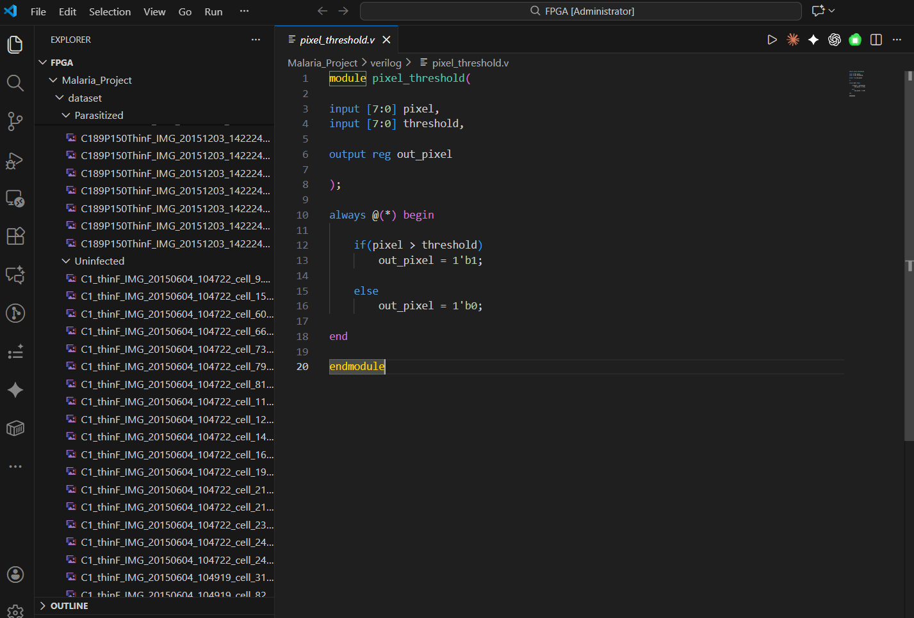

---

## 2. Python Preprocessing

Initial preprocessing pipeline used before image analysis.

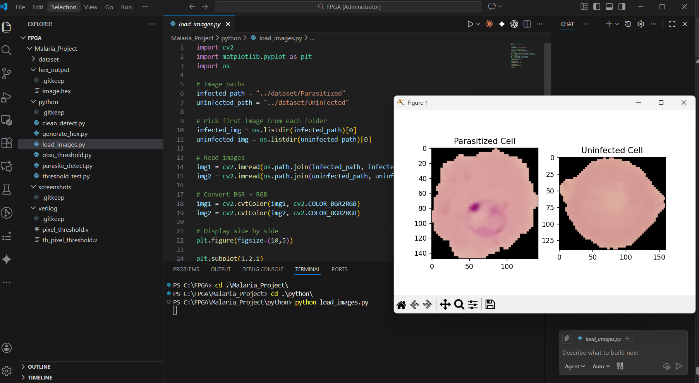

---

## 3. Grayscale Conversion

The RGB malaria image is converted into grayscale to simplify image processing and reduce computational complexity.

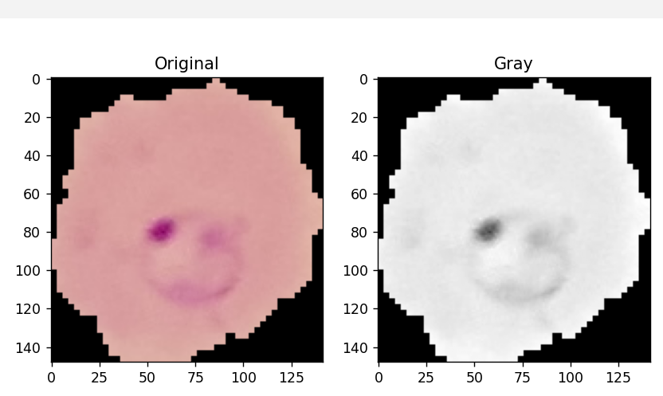

---

## 4. Threshold Binary Output

Thresholding converts grayscale pixels into binary values (black/white) for easier segmentation.

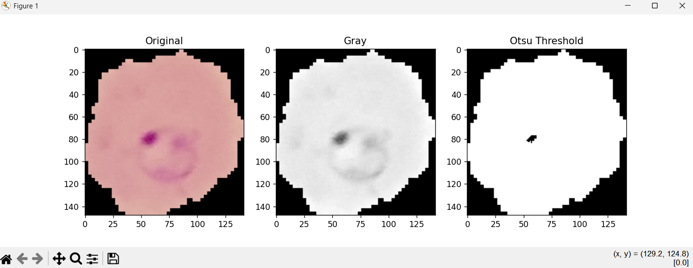

---

## 5. Parasite Detection Output

Detected infected regions after image processing.

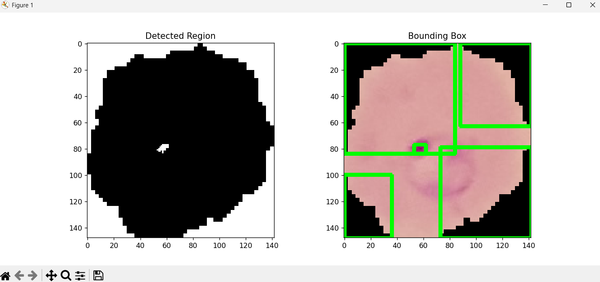

---

## 6. HEX Output

Processed image pixels converted into HEX format for Verilog processing.

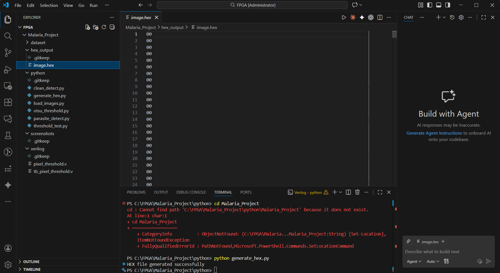

---

## 7. Pixel Threshold Verilog Module

Verilog module that compares incoming pixel values against a threshold value.

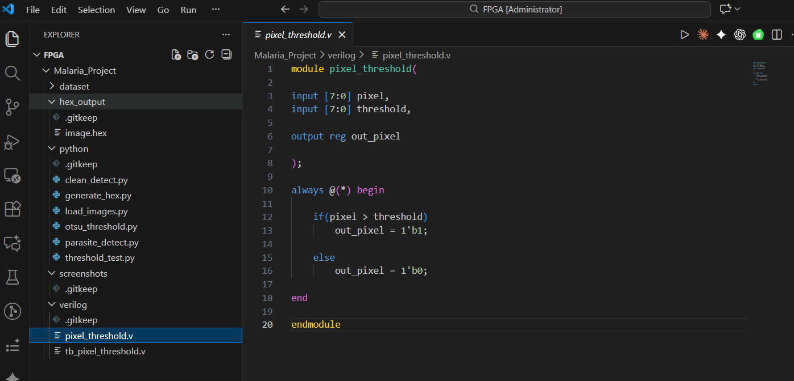

---

## 8. Infected Counter Module

Counter module used to count infected pixels/cells.

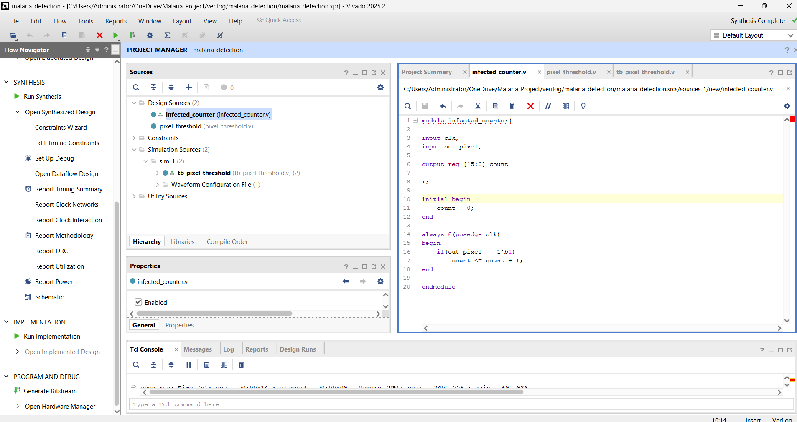

---

## 9. Testbench Setup

Testbench used to verify functionality of the design.

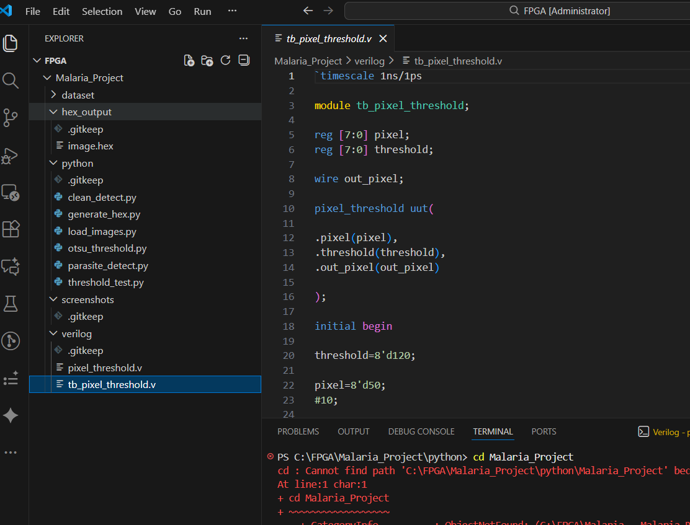

---

## 10. Waveform Output

Simulation waveform generated from Vivado.

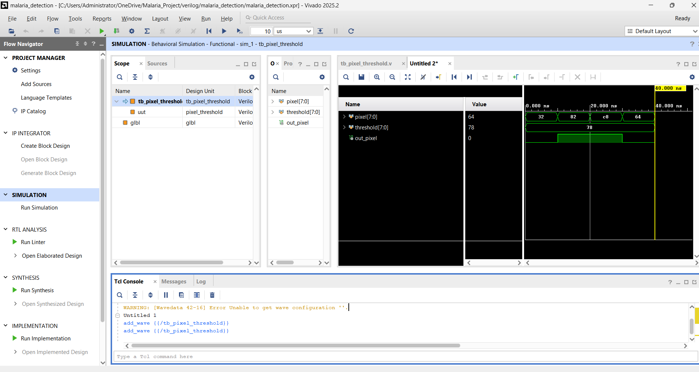

---

## 11. Infected Cell Count

Final count value generated after processing infected regions.

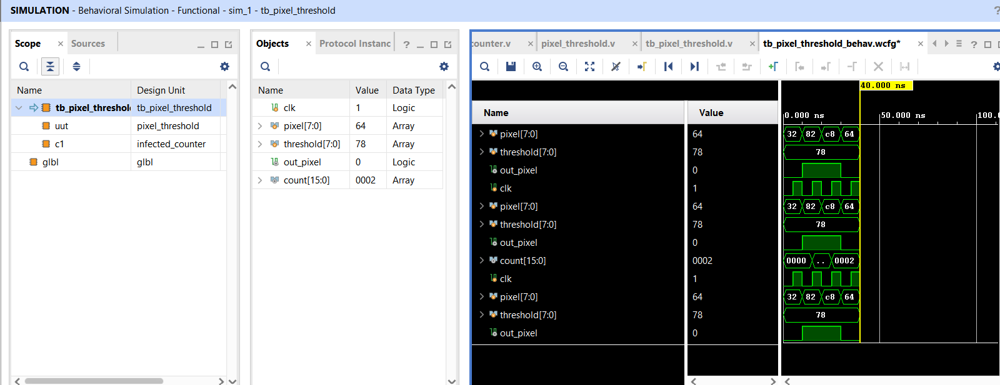

---

## 12. Synthesis Completed

Successful Vivado synthesis execution.

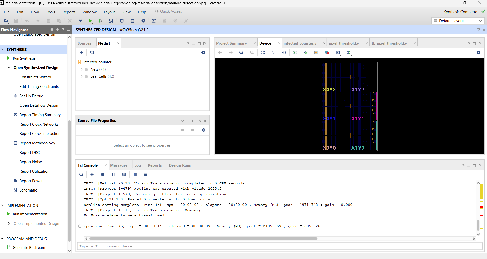

---

## 13. Utilization Report

FPGA resource usage report showing LUTs, registers and hardware utilization.

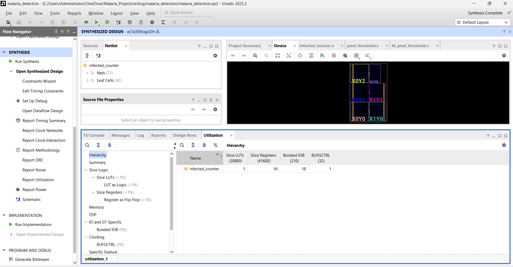

---

# Final Result

Hardware simulation successfully identified threshold-crossing pixels and produced:

```text
count = 2
```

The project demonstrates integration of:

Python image processing

+

HEX generation

+

Verilog hardware logic

+

Vivado simulation

for simplified malaria parasite detection.

---

# Future Improvements

Possible extensions:

- CNN-based classification
- Real FPGA deployment
- Live camera integration
- Larger datasets
- Automatic parasite localization
- Deep learning acceleration
- Real-time FPGA processing